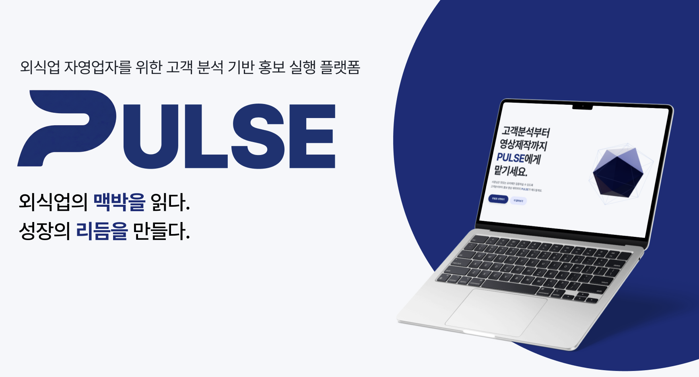
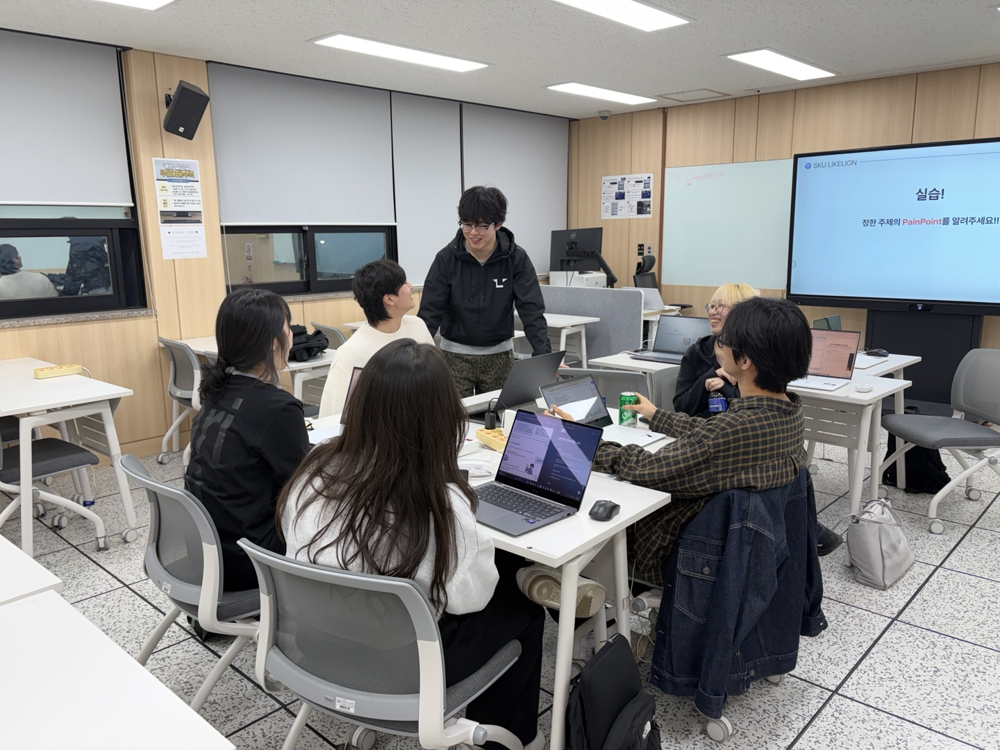

<div align="center">
  

  <h1>Noh Tae Kyung Portfolio</h1>
  <p>
    문제를 정의하고, 흐름으로 번역하고, 실행 가능한 제품 경험으로 만드는 PM/UX 포트폴리오입니다.
  </p>

  <p>
    <a href="https://skunohtaekyung.github.io/">Live Site</a>
    ·
    <a href="mailto:ntk9477@naver.com">Contact</a>
    ·
    <a href="https://github.com/SKUnohtaekyung">GitHub</a>
  </p>

  <p>
    
    
    
    
  </p>
</div>

## About

이 저장소는 노태경의 PM/UX 포트폴리오 웹사이트입니다. 단순히 결과물을 나열하기보다, 문제를 어떻게 발견했고 어떤 기준으로 의사결정했으며 무엇을 검증했는지까지 한 흐름으로 보여주는 인터랙티브 포트폴리오를 목표로 했습니다.

## Featured Work

| Project | Role | Focus |
| --- | --- | --- |
| **PULSE** | Team Lead, PM, UI/UX, Frontend | 외식업 사장님이 리뷰/고객 데이터를 보고 바로 홍보 실행까지 이어갈 수 있는 AI 마케팅 비서 |
| **PickFit** | Personal Project, PM/UX, Full-stack Planning | 상황과 취향을 입력하면 코디 후보를 좁혀 주는 AI 패션 추천 경험 |
| **LikeLion** | PM/UX Curriculum Lead | 초보자가 PM/UX 사고를 실제 프로젝트 흐름으로 익히도록 설계한 20주 커리큘럼 |

<p align="center">
  
  
  
</p>

## Tech Stack

- **Frontend:** React, TypeScript, Vite, Tailwind CSS
- **Motion & Interaction:** Framer Motion, GSAP, Lenis
- **3D / Visual:** Three.js, React Three Fiber, Drei
- **Routing:** React Router
- **Deployment:** GitHub Pages with GitHub Actions

## Project Structure

```text
src/
  components/      # 재사용 UI, 히어로, 전환, 프로젝트 룸 컴포넌트
  data/            # 포트폴리오 콘텐츠와 프로젝트 메타데이터
  lib/             # 모션, 스크롤, 커버 유틸리티
  pages/           # 랜딩과 프로젝트 상세 화면
public/images/     # 웹에서 직접 참조하는 이미지 에셋
manifest/          # 이미지/문서/근거 자료 매니페스트
docs/              # 에셋 인덱스와 제작 문서
qa/                # QA 리포트와 검증 기록
```

## Getting Started

```bash
npm install
npm run dev
```

프로덕션 빌드는 아래 명령으로 확인할 수 있습니다.

```bash
npm run typecheck
npm run build
```

## Deployment

`main` 브랜치에 푸시하면 GitHub Actions가 Vite 앱을 빌드하고 GitHub Pages에 배포합니다. React Router의 직접 진입 경로도 동작하도록 빌드 후 `404.html`을 함께 생성합니다.

## Contact

- Email: [ntk9477@naver.com](mailto:ntk9477@naver.com)
- GitHub: [SKUnohtaekyung](https://github.com/SKUnohtaekyung)
